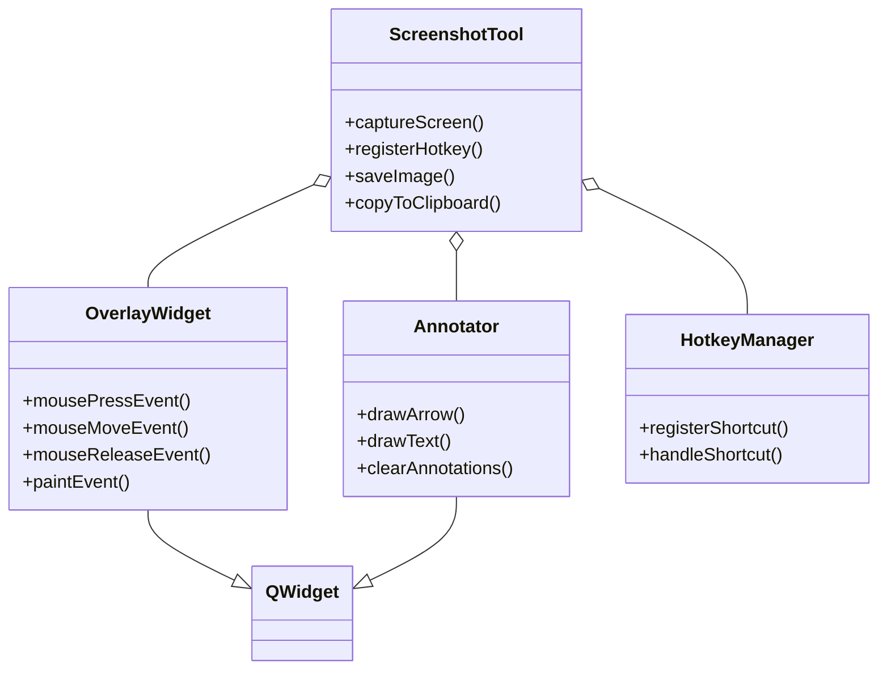
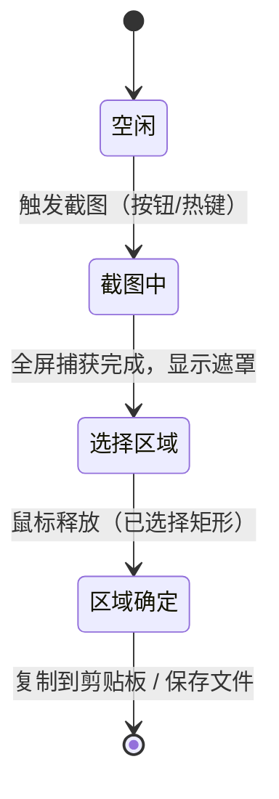

# 执行摘要

本文档面向开发者，系统性讲解如何使用**Qt（支持 Qt5 和 Qt6）**实现类微信截图/QQ截图/Windows Snipping Tool 的本地（原生）截图工具。我们首先列出工具目标与功能清单，包括核心功能（区域/窗口/全屏截图、选区复制、文件保存）和可选扩展（延时截图、多显示器支持、高DPI 处理、热键触发、标注编辑等）。接着分别讨论各平台（Windows、macOS、X11、Wayland）的兼容性与限制，如 Windows 安全桌面（UAC）不可截图、macOS 需开启“屏幕录制”权限、Wayland 下 Qt 无法直接截屏等。然后给出架构设计，包括模块划分、类图和状态机示意（使用 Mermaid 图），说明全屏捕获、透明遮罩、选区绘制、剪贴板交互等逻辑流。文中通过示例 C++/Qt5/6 代码讲解实现步骤：创建**全屏透明窗口**、合并多屏 QPixmap、鼠标事件绘制遮罩与选区、多显示器与高DPI 兼容、延时截图方案、抓取单个窗口、截图后的区域编辑/标注、结果复制到剪贴板或保存为文件、全局快捷键注册（可参考 QHotkey 库）等。最后提供性能优化（避免无谓全屏刷新、管理大图显存等）、安全权限（Wayland Portal、macOS 权限 UAC 限制等）、测试计划、部署打包建议（Qt 运行时依赖、应用签名、沙箱准入）、示例工程结构（qmake/CMake）和 API 参考表格，并附常见问题与调试技巧及第三方库推荐。所引用资料包括 Qt 官方文档、平台技术文档及权威资料。

## 目标与功能清单

- **必需功能**（核心功能）：  
  - **区域截图**：支持鼠标拖拽选区截图（类似“QQ截图”Ctrl+Alt+A）。  
  - **窗口截图**：识别并截取当前活动窗口或指定窗口（使用 `QWidget::winId()` 获取窗口句柄）。  
  - **全屏截图**：快速捕获整个虚拟桌面（所有显示器），组合成一张大图。  
  - **选区复制/保存**：将截图结果复制到剪贴板或保存到文件（PNG/JPEG 等）。  
  - **遮罩与选框显示**：截屏时在界面上绘制半透明遮罩和红色选区边框（参考 Windows 截图工具效果）。  

- **可选增强功能**：  
  - **延时截图**：支持设定延时（例如 3~5 秒）后自动截图，让用户准备界面或隐藏当前窗口。  
  - **多显示器支持**：自动识别并支持多屏（组合各屏捕获的 QPixmap），例如不同位置或分辨率的屏幕。  
  - **高DPI兼容**：处理 Retina/4K 等高 DPI 情况，注意 `QScreen::grabWindow()` 返回的 `QPixmap` 可能带有 `devicePixelRatio()>1`，需使用 `pixmap.devicePixelRatio()` 或 `QScreen::devicePixelRatio()` 调整坐标。  
  - **针对指定窗口截图**：通过窗口句柄截取单个应用窗口（捕获的是屏幕上当前显示的内容，即被遮挡部分会出现在截图中）。  
  - **图像编辑/标注**：截图后提供简单绘图或文本注释功能（如绘制箭头、框选、文字说明等），可集成 `QPainter` 或 `QGraphicsScene` 进行二次编辑。  
  - **滚动/长截图**：支持对超出屏幕范围的长页面滚动捕获（例如网页滚动截图，需要手动控制滚动并多次拼接图像）。  
  - **屏幕录制（可选）**：提供视频录制功能（非截图范畴，此处可提到作为未来扩展）。  
  - **全局快捷键**：注册系统级热键触发截图（如 PrintScreen、Ctrl+Shift+S），可使用第三方库如 [QHotkey](https://github.com/Skycoder42/QHotkey)（支持 Windows/macOS/X11，但Wayland下不支持全局钩子）。  

参考QQ截图工具的功能矩阵，基础功能层包括区域截图、窗口截图、全屏截图等，进阶功能层包括OCR文字识别、长截图、录屏等。上述功能中，本地截图需求主要关注基础功能和有限的标注编辑，OCR、录屏可视为额外扩展项。


## 平台兼容性与限制

在跨平台设计时，需要分别考虑 Windows、macOS、Linux（X11/Wayland）环境的差异和系统限制，并提出相应解决方案：

- **Windows**：  
  - 截屏方式：`QScreen::grabWindow(0)` 可直接捕获桌面内容。Qt 对 Windows 平台直接调用系统 API 实现截屏（效果与 GDI 类似）。  
  - 注意事项：默认情况下 **安全桌面**（Secure Desktop）上的 UAC 提示框无法截图。这可以通过策略修改（取消安全桌面）或忽略此场景来解决；此外隐藏与显示窗口时应避免捕获自身界面。  
  - 全局热键：可使用 WinAPI `RegisterHotKey` 或第三方库（如 QHotkey）注册 PrintScreen 等快捷键。  

- **macOS**：  
  - 截屏方式：`QScreen::grabWindow(0)` 在 macOS 下使用 Quartz 实现，可正常捕获屏幕。  
  - 权限限制：从 macOS 10.15 Catalina 及以上版本开始，程序**必须在“系统设置→隐私与安全→屏幕录制”中被授予权限**，才能截取屏幕内容。否则即使调用 `grabWindow()`，也只能得到一张空白桌面图像。需要提醒用户到系统设置开启“屏幕录制”权限并重启应用。  
  - 特殊情况：同 Windows，UAC 无对应项；一般无需额外签名即可捕获（但如果将程序打包上架 App Store 或启动时敏感场景，可参考 Apple 人机接口指南）。  

- **Linux (X11)**：  
  - 截屏方式：`QScreen::grabWindow()` 通过 XCB 实现，可捕获当前 X11 桌面。支持多屏（使用 `QApplication::screens()` 遍历组合各屏幕图像），以及针对指定窗口（通过窗口 ID）截取。  
  - 注意事项：X11 下截屏会捕获到可见像素，即若目标窗口被其他窗口遮挡，其截图结果中遮挡区域为其他窗口内容；并且若窗口颜色深度与根窗口不同，被遮挡部分可能产生未定义内容。总体来说，X11 实现简单，常规截图不受额外权限限制。  

- **Linux (Wayland)**：  
  - 截屏方式：Qt 目前**不支持**在 Wayland 上直接使用 `QScreen::grabWindow()`（该函数返回空图）。这是由于 Wayland 安全模型禁止客户端直接读取其他窗口或屏幕缓冲区。  
  - 替代方案：可借助 XDG-Desktop-Portal 的截图功能（`org.freedesktop.portal.Screenshot` 接口），或者调用特定工具（例如 GNOME 的 `gnome-screenshot` 或 KDE 的 `spectacle`）。对于 Flatpak/Snap 应用，系统会自动通过门户 API 弹出授权对话框。注意使用这些方法需要额外的 D-Bus 或命令行交互，目前 Qt 尚无内置封装。  
  - XWayland：如果应用在 XWayland 环境下运行，`grabWindow()` 可能暂时有效，但不应依赖该方案作为主要实现。  

综上，可用表格对比不同平台：

| 平台       | 截屏方法                                   | 限制与注意事项                                    |
|----------|---------------------------------------|---------------------------------------------|
| Windows  | `QScreen::grabWindow(0)`（基于 GDI） | 捕获整个桌面（包括所有可见窗口）。无法截取**安全桌面**（UAC 提示框）。热键可用 WinAPI/QHotkey 注册。 |
| macOS    | `QScreen::grabWindow(0)`（Quartz 实现）       | 需在“隐私与安全→屏幕录制”授权，否则只能截到空白桌面。多屏显示正常。无需其它系统权限。 |
| Linux X11| `QScreen::grabWindow(0)`（XCB） | 自动支持多屏。截图结果为当前屏幕像素，遮挡处显示覆盖内容。无需额外权限。 |
| Linux Wayland| 需调用外部接口（如 XDG Portal 截图）      | Qt 无法直接截屏。必须使用系统级截图接口（portal、command-line 工具等）并处理权限授权。 |

## 架构设计

整个截图工具可划分为如下模块（图中以类关系示意）：  



- **ScreenshotTool**：主控类，负责启动截图过程、管理各模块、处理截屏后的结果（复制/保存）等。  
- **OverlayWidget**：全屏透明遮罩窗口（继承自 `QDialog` 或 `QWidget`，设置 `FramelessWindowHint` 和 `WA_TranslucentBackground` 属性），用于显示截图预览和交互选区。监听鼠标事件绘制选区。  
- **Annotator**（可选）：截图后的标注编辑界面，允许用户在捕获图像上绘制箭头/矩形/文字等。可使用 `QGraphicsScene` 或在 `QWidget` 上重写 `paintEvent` 实现。  
- **HotkeyManager**：全局热键管理，可使用 [QHotkey](https://github.com/Skycoder42/QHotkey) 实现跨平台（Windows/macOS/X11）热键监听。  

状态机示意图展示了截图流程：  



## 详细实现步骤与关键代码示例

下面分步骤说明核心功能的实现细节，并给出关键 C++/Qt 代码示例。示例适用于 Qt5/Qt6（差异会在注释中说明）。

### 1. 创建全屏透明窗口

我们需要一个覆盖整个桌面的无边框窗口来显示截图与选区。可以使用 `QDialog` 或 `QWidget`，并设置：`Qt::FramelessWindowHint`、`Qt::WindowStaysOnTopHint`（确保置顶）以及 `setAttribute(Qt::WA_TranslucentBackground)`（透明背景）。同时，要让窗口跨多屏并包含所有屏幕区域，可使用主屏的虚拟桌面几何。示例构造函数如下：  

```cpp
class SelectorWidget : public QDialog {
    Q_OBJECT
public:
    SelectorWidget() : QDialog(nullptr, Qt::FramelessWindowHint | Qt::WindowStaysOnTopHint) {
        // 全屏覆盖所有显示器（Qt5 用 QApplication::desktop(); Qt6 用 QGuiApplication::primaryScreen()/screens()）
        QRect desktopGeom = QGuiApplication::primaryScreen()->virtualGeometry();
        setGeometry(desktopGeom);
        // 允许背景透明
        setAttribute(Qt::WA_TranslucentBackground);
        // 截取全屏图像做背景
        fullPixmap = grabFullScreen();
    }
    // ...
    QPixmap fullPixmap;
};
```

在上述代码中，我们调用 `grabFullScreen()` 函数获取覆盖所有屏幕的完整截图（见下节），并将其绘制为窗口背景。在构造时也可以立即完成截图。若需 **延时截图** 功能，可先隐藏自己的界面（例如 `this->hide()`），使用 `QTimer::singleShot()` 延时后调用截图函数，最后显示遮罩窗口。

### 2. 获取整屏 QPixmap

跨多显示器截图时，需要考虑虚拟桌面的几何大小。示例代码（Qt5/Qt6 通用）如下：  

```cpp
QPixmap grabFullScreen() {
    // 计算虚拟桌面大小
    QList<QScreen*> screens = QGuiApplication::screens();
    QRect virtualRect;
    for (QScreen *screen : screens)
        virtualRect |= screen->geometry();
    // 创建与虚拟桌面同样大小的 pixmap
    QPixmap result(virtualRect.size());
    QPainter painter(&result);
    // 遍历每个屏幕，把它的截图绘制到对应位置
    for (QScreen *screen : screens) {
        QPixmap pix = screen->grabWindow(0);
        // 注意高DPI：如果每屏返回 pix.devicePixelRatio()>1，可先调用 pix.setDevicePixelRatio(screen->devicePixelRatio())
        QPoint topLeft = screen->geometry().topLeft() - virtualRect.topLeft();
        painter.drawPixmap(topLeft, pix);
    }
    return result;
}
```

以上代码调用 `QScreen::grabWindow(0)` 抓取每个屏幕（主屏、扩展屏等）的内容，然后使用 `QPainter` 将各张图拼接到整体大图中。由于 `grabWindow()` 返回的尺寸以“设备无关像素”（DIP）表示，高 DPI 屏幕上可能需要考虑 `pix.devicePixelRatio()`。

### 3. 鼠标交互绘制遮罩与选区

在覆盖窗口上，实现鼠标事件以让用户拖拽选择截图区域。常见做法是重写 `mousePressEvent`、`mouseMoveEvent`、`mouseReleaseEvent` 和 `paintEvent`。示例（从 [Qt 论坛](https://forum.qt.io/)摘录）：  

```cpp
class SelectorWidget : public QDialog {
    // ...
    QRect selectionRect;
    QPoint startPoint;
protected:
    void mousePressEvent(QMouseEvent* event) override {
        // 记录选区起点
        startPoint = event->globalPos();
        selectionRect = QRect(startPoint, QSize());
    }
    void mouseMoveEvent(QMouseEvent* event) override {
        // 更新矩形终点并重绘
        selectionRect = QRect(startPoint, event->globalPos()).normalized();
        update();
    }
    void mouseReleaseEvent(QMouseEvent* event) override {
        // 最后一次更新并结束选择（关闭遮罩窗口）
        selectionRect = QRect(startPoint, event->globalPos()).normalized();
        accept(); // QDialog::Accepted
    }
    void paintEvent(QPaintEvent*) override {
        QPainter p(this);
        // 绘制完整截图作为背景
        p.drawPixmap(0, 0, fullPixmap);
        // 使用路径实现遮罩效果：遮罩所有区域，挖出选区矩形
        QPainterPath path;
        path.addRect(rect());
        path.addRect(selectionRect);
        p.fillPath(path, QColor(0,0,0,100)); // 半透明黑
        // 绘制红色选区边框
        p.setPen(Qt::red);
        p.drawRect(selectionRect);
    }
};
```

在 `mouseReleaseEvent` 中，我们通过 `fullPixmap.copy(selectionRect)` 获取用户选中的图像。注意应使用 `.normalized()` 以处理鼠标拖动时负宽高的情况。`paintEvent` 绘制时，先画全屏背景图，再用半透明遮罩覆盖，再用明显的红框标示选区。

### 4. 缩放、多显示器与高 DPI 处理

- **多显示器**：代码示例已经演示了遍历 `QScreen::screens()` 并根据各自几何拼接图像。务必使用 `screen->geometry()` 获取每个屏的相对位置，这里使用虚拟桌面左上为原点。  
- **高 DPI**：`QScreen::grabWindow()` 以逻辑坐标（DIP）捕获图像，返回的 `QPixmap` 的物理尺寸可能是逻辑尺寸乘以 `devicePixelRatio()`。处理时可调用 `pixmap.setDevicePixelRatio(screen->devicePixelRatio())` 或在合并后统一考虑。画布（`QPainter`）使用逻辑坐标即可正确绘制，但最终输出图像的分辨率应考虑 DPI 比例。  
- **任意缩放（页面缩放）**：如果应用要求对选区进行缩放显示，可在展示预览时使用 `QPixmap::scaled()`，但注意精度损失。一般应在完整尺寸上操作选区，然后在保存或复制前根据需要缩放结果图。  

### 5. 延时截图

对于延时功能，可使用 `QTimer` 实现：在用户点击截图按钮或按下热键后，先隐藏主窗口和遮罩窗口，然后调用 `QTimer::singleShot(delay_ms, [this]{ captureScreen(); showOverlay(); });`。在回调中调用上述的截屏函数（例如 `grabFullScreen()`），之后再显示遮罩界面供用户选择。截图后可重新显示主窗口。Qt 的官方示例中也演示了延时拍照的选项。

### 6. 窗口截图

若需截取**指定窗口**（而非整个屏幕），可以使用目标窗口的 `WId`。例如，传入一个 `QWidget` 的 `winId()`：  

```cpp
QWidget *target = /* 指定窗口指针 */;
WId handle = target->winId();
QScreen *screen = target->windowHandle()->screen();
QPixmap windowSnap = screen->grabWindow(handle);
```

或者只截取当前应用的一个窗口：`screen->grabWindow(widget->winId())`。如 Qt 文档所述，此方法会抓取窗口在屏幕上的像素（包括窗口边框），如果被其它窗口遮挡，遮挡部分会出现在截图中。注意：**iOS、一些沙盒环境以及部分平台对非自身窗口的读取有安全限制**，但在桌面常见系统上通常可行。

### 7. 区域编辑与标注

截图后可让用户进行标注，比如在选取结果上使用 `QPainter` 绘制箭头、文本或其他标识。常用方法是在另一个 `QWidget` 或 `QGraphicsView` 中加载截取的 `QPixmap`，并重写 `paintEvent` 或使用图形项（QGraphicsScene/QGraphicsView）进行交互式编辑。这部分功能较复杂，可作为可选扩展模块实现，不在本核心演示中详述。重点在于获取 `QPixmap` 后，可随时对其调用 `QPainter` 进行修改，再输出最终结果。

### 8. 复制到剪贴板

截图完成后，通常将结果放到系统剪贴板以便快速粘贴。Qt 提供 `QClipboard` 类访问剪贴板。示例：  

```cpp
QClipboard *clipboard = QGuiApplication::clipboard();
clipboard->setPixmap(croppedPixmap); // 将选区图像复制到剪贴板
```

这样，用户即可在 QQ/微信/Word 等程序中粘贴该截图。Qt 官方文档中说明 `QClipboard` 支持 `setPixmap()` 方法用于复制图像。

### 9. 保存文件

可以提示用户保存文件。示例代码：  

```cpp
QString fileName = QFileDialog::getSaveFileName(this, "保存截图", "", "PNG 文件 (*.png);;JPEG 文件 (*.jpg *.jpeg)");
if (!fileName.isEmpty()) {
    croppedPixmap.save(fileName);
}
```

支持常见图像格式（PNG 通常无损、JPEG 有损）。若需要在后台自动保存，可根据时间戳或配置指定路径保存，无需用户交互。

### 10. 快捷键 / 热键注册

为了提高用户体验，可注册全局快捷键（如 PrintScreen 或自定义按键）触发截图功能。Qt 本身不提供跨应用的全局热键功能，但可使用第三方库或平台 API：  
- **QHotkey**（开源库）：支持 Windows、macOS、X11，全局注册按键。使用示例：`QHotkey *hotkey = new QHotkey(QKeySequence("Ctrl+Shift+A"), true, this); connect(hotkey, &QHotkey::activated, this, &ScreenshotTool::onShortcut);`。  
- **本地 API**：在 Windows 上可用 `RegisterHotKey()`，在 X11 下可用 `QAbstractNativeEventFilter` 加 `XGrabKey()`，在 macOS 可用 Carbon 或 Cocoa 注册（相对繁琐）。  
- **注意**：Wayland 环境通常不允许应用注册全局快捷键（与截图行为一致），这里需要用户自行设置环境快捷键或限于应用内快捷键。  

以上实现步骤和示例代码构成了截图功能的核心流程：**隐藏/准备** → **捕获屏幕** → **显示遮罩与选择** → **剪切结果** → **输出/保存**。参考 Qt 官方截图示例可发现思路相同。

## 性能与内存优化建议

- **避免全屏实时重绘**：遮罩窗口绘制时，只需在用户拖动时更新界面（`update()`），不需要每帧都重绘整个屏幕。可在选区未确定时仅在 `mouseMoveEvent` 中调用 `update()`，这样 `paintEvent` 有目的地绘制。  
- **管理大图内存**：全屏截图在高分辨率、多显示器下可能产生非常大的 `QPixmap`，占用显存或内存。完成选区截取后，应尽快释放无用的全屏图，保留最小范围 `croppedPixmap`。如果长期保存多个截图，可考虑存储为 `QImage`（内存更紧凑）或在不需要时调用 `QPixmap::detach()` 等。  
- **避免多余拷贝**：直接操作 `QPixmap`，尽量使用指针或引用传递，减少不必要的深拷贝（尤其是对大图像）。  
- **线程与异步**：截图本身在主线程执行可能导致界面短暂卡顿，如需连续多次截图或加复杂后处理，可考虑将截图和处理逻辑放到后台线程，然后通过信号传回主线程显示。  
- **硬件加速**：`QPixmap` 在某些平台会使用硬件加速，可利用显存提速。但跨屏合成与透明绘制仍主要消耗 CPU。若需要更高性能，可以考虑使用 Qt Quick (QML) 的 `Window::grabWindow()` 等接口或 GPU 纹理复制，但复杂度高。  

## 安全与权限注意事项

- **Wayland 限制**：Wayland 的安全模型限制应用截取屏幕内容，因此 Qt 的 `grabWindow()` 在 Wayland 下通常返回空图或失败。推荐做法是检测运行环境：如果在 Wayland 上，提示用户或调用 `xdg-desktop-portal` 进行截图（需引入 D-Bus 接口，超出本文范围）。切记不要期待 `grabWindow()` 在 Wayland 上有效。  
- **macOS 权限**：在 macOS 10.15+，需要在“系统设置→隐私与安全→屏幕录制”中为应用勾选权限，否则无法捕获屏幕。应用首次截屏时会失败（只得到空白），需引导用户打开权限并重启程序。Qt 无法直接弹出系统授权对话，只能提示用户手动配置。  
- **Windows UAC**：如前所述，Windows 的 UAC 提示属于“安全桌面”，默认情况下截图工具无法捕获该对话框。通常可以忽略这个案例或通过注册表策略取消安全桌面。  
- **Linux 限制**：X11 上无需额外权限；在 Wayland 上，如以 Flatpak/Snap 形式部署，应添加相应权限（`portal`）或在打包描述文件中声明屏幕共享权限。  
- **应用沙箱**：如果应用在受限环境（如 Apple 签名沙箱或企业管理环境）运行，截屏功能可能额外受限，需要检查相关平台文档。  

## 测试计划与用例

- **功能测试**：验证区域截图、窗口截图、全屏截图等功能在各种常见场景下工作正常。包括不同拖拽方向、最小/最大/负向选区测试。  
- **跨平台兼容**：在 Windows、macOS、X11 环境下分别测试截屏功能和剪贴板粘贴是否正常。特别测试高 DPI（4K 屏）和多显示器下截图是否完整无缺。  
- **性能测试**：测量截图和保存操作延迟，观察内存使用峰值。测试在极端条件下（超多屏、极高分辨率）下的表现。  
- **边界条件**：测试无活动窗口时截屏、捕获半屏（跨屏边界）时的正确性，模拟权限不足（macOS 未授权、Wayland 环境）时的行为和提示。  
- **用户交互**：测试鼠标选区反馈是否流畅、遮罩效果正确；快捷键冲突和响应是否正常。  
- **稳定性**：长时间截图流程多次循环后检查内存泄漏，可使用 Qt 自带的工具（`Valgrind`、`Dr. Memory` 或 Qt Creator 的分析器）检测。  
- **边界测试**：选区超出屏幕、图像文件保存到只读路径、剪贴板异常等场景下软件容错处理。  

## 部署与打包注意

- **Qt 运行时**：发布时要包含需要的 Qt 库（widgets/gui等）。Windows 可选择静态链接（注意 LGPL 授权）或动态链接；macOS 通常打包为 `.app`，可使用 `macdeployqt` 工具。  
- **签名**：macOS 应用若不签名，将无法启用屏幕录制权限（在权限设置中也无法勾选）。因此发布前需对应用进行代码签名，并获取相应的使用者许可。Windows 可选代码签名以防止杀毒软件误报。  
- **沙箱/权限**：如果通过 Flatpak/Snap 打包，需要添加对 `xdg-desktop-portal` 的访问权限。macOS 沙箱应用在截屏时只能捕获自身窗口，无其他解决方案。  
- **安装程序**：在 Windows 上可使用 Inno Setup、NSIS 或其他安装器，确保安装时注册热键（如注册表），或向用户提示。Linux 多为发行版包或 AppImage。  
- **资源与本地化**：若支持多语言，可为用户界面（按钮、菜单、提示）编写翻译文件。Qt 国际化机制（`tr()`）可用于界面文本。本开发注重技术实现，界面非常简洁，翻译需求较少。  

## 示例工程结构与构建脚本

建议项目目录结构如下：  

```
/MySnippingTool
  |-- src/               # 源代码
      |-- main.cpp
      |-- ScreenshotTool.h/.cpp
      |-- OverlayWidget.h/.cpp
      |-- AnnotatorWidget.h/.cpp (可选)
      |-- HotkeyManager.h/.cpp
  |-- resources/         # 图标、qrc 资源文件等
      |-- icons/
      |-- translations/  # (可选) Qt .ts 文件
  |-- tests/             # (可选) 单元测试
  |-- CMakeLists.txt 或 mytool.pro
  |-- README.md
```

- **CMake**（Qt6 推荐）：`CMakeLists.txt` 示例：  
  ```cmake
  cmake_minimum_required(VERSION 3.16)
  project(SnippingTool LANGUAGES CXX)
  set(CMAKE_CXX_STANDARD 17)
  find_package(Qt6 REQUIRED COMPONENTS Widgets Gui)
  add_executable(SnippingTool
      src/main.cpp
      src/ScreenshotTool.cpp src/ScreenshotTool.h
      src/OverlayWidget.cpp src/OverlayWidget.h
      src/HotkeyManager.cpp src/HotkeyManager.h
      # ...其他文件
  )
  target_link_libraries(SnippingTool PRIVATE Qt6::Widgets Qt6::Gui)
  # 如使用 QHotkey，可使用 CPM 或 add_subdirectory 引入
  ```
- **qmake**（Qt5 时代）：`.pro` 示例：  
  ```qmake
  QT += widgets gui
  CONFIG += c++17
  SOURCES += src/main.cpp \
             src/ScreenshotTool.cpp src/OverlayWidget.cpp \
             src/HotkeyManager.cpp
  HEADERS += src/ScreenshotTool.h src/OverlayWidget.h \
             src/HotkeyManager.h
  # 若使用资源文件：
  RESOURCES += resources/resources.qrc
  ```

构建时使用 Qt Creator 或命令行即可。在 CMake 中加入 `AUTOUIC`, `AUTOMOC` 设置可以自动处理 UI 文件/信号槽。编译完成后生成可执行文件或应用包，根据平台进一步打包签名即可。

## API 参考表

下面列出工具中会用到的一些关键 Qt 类及方法（包含所属类、函数或信号、主要参数及用途）：

| 类 / 对象         | 方法 / 信号               | 参数 / 返回值及说明                                               |
|-----------------|------------------------|-------------------------------------------------------------|
| **QScreen**     | `grabWindow(WId, x, y, w, h)` | 返回指定窗口/屏幕区域的 `QPixmap`。<br>参数 `window=0` 表示整个屏幕；`x,y,w,h` 为区域。返回图像可能带有 `devicePixelRatio`。 |
|                 | `geometry()`            | 返回当前屏幕的几何矩形（包含偏移）。                                |
| **QPixmap**     | `copy(const QRect &)`   | 返回此 pixmap 指定矩形区域的深度拷贝（用于裁剪选区）。         |
|                 | `save(const QString&, const char *format=0)` | 将图像保存到文件（自动根据扩展名或 `format` 识别格式）。              |
| **QPainter**    | `drawPixmap(...)`       | 绘制一个 pixmap 到设备上下文（在 `paintEvent` 中绘制完整屏幕背景）。          |
|                 | `fillPath(const QPainterPath&, QColor)` | 使用路径和颜色填充（用于绘制半透明遮罩）。                        |
| **QClipboard**  | `setPixmap(const QPixmap&)` | 将 `QPixmap` 放入系统剪贴板。其他类型：`setText()`, `setImage()`。 |
| **QWidget/QDialog** | `setWindowFlags(...)` 和 `setAttribute(...)` | 设置窗口标志（无边框、置顶）和属性（透明背景）。例如：`Qt::FramelessWindowHint`, `WA_TranslucentBackground`。 |
|                 | `mousePressEvent(QMouseEvent*)` / `mouseMoveEvent` / `mouseReleaseEvent` | 鼠标事件，用于实现框选逻辑。                              |
|                 | `paintEvent(QPaintEvent*)` | 重写绘制选区遮罩和边框。                                      |
| **QTimer**      | `singleShot(int, QObject*, slot)` | 设置延时单次触发，用于延时截图。                                    |
| **QFileDialog** | `getSaveFileName(...)`  | 打开文件保存对话框，返回用户选择的路径。                               |
| **QGuiApplication** | `clipboard()`          | 静态函数，获取全局 `QClipboard` 对象。                            |
|                 | `screens()` / `primaryScreen()` | 获取屏幕列表或主屏。                                         |
| **其他信号**     | `QKeySequence::activated()` | （若使用 QHotkey 库）热键激活信号。                      |

以上仅列出部分常用的 API（截图工具可参考 Qt 文档进一步学习）；具体可根据设计需要扩展，比如 `QWidget::grab()`（抓取当前窗口自身内容）在窗口截图时也可用，但对跨进程窗口无效。

## 常见问题与调试技巧

- **截图后图像全黑或空白**：通常是由于未获取权限或环境不支持。macOS 上请检查“屏幕录制”权限；Wayland 下请尝试使用系统截图工具，因为 `grabWindow()` 在 Wayland 下无效。  
- **选区无法正确绘制**：请检查坐标转换是否正确（鼠标全局坐标 vs 窗口坐标），确保对齐方式无误；在多屏环境下，确保虚拟桌面几何和绘图都使用同一参考系。  
- **复制后粘贴无效**：确认使用了 `QClipboard::setPixmap()` 并且粘贴目标支持图像粘贴（如某些旧应用可能不支持）；可尝试先保存到文件打开验证图像是否正常。  
- **热键注册失败**：在同一应用中注册多次冲突或与系统快捷键冲突会失败。对于 QHotkey，检查是否已调用 `setShortcut()` 注册成功，必要时提示用户修改快捷键。Wayland 下不支持全局热键，可在应用内使用快捷键。  
- **性能问题**：如截图卡顿，可在调试时使用 Qt Creator 的调试器或内存分析工具观察是否有内存泄漏或反复构造销毁大对象。  
- **日志输出**：可在关键步骤（截图前后、文件保存路径、权限检查等）添加 `qDebug()` 打印日志，方便定位截屏是否执行和结果大小。  

## 第三方库或工具推荐

- **QHotkey (GitHub)**：跨平台全局快捷键库，使用简单，支持 Qt5/6。  
- **xdg-desktop-portal**：在 Wayland 环境下使用系统截屏服务。有关实现可参考 [Flatpak 文档](https://flatpak.github.io/docs/portals.html)。  
- **KDav Sketch or QPainterAnnotator**：用于图像标注的第三方组件（示例：KDav 提供的轻量绘图模块）。  
- **Snipping Tool 仿真示例**：开源项目 [GitHub: QtSnippingTool](https://github.com/username/QtSnippingTool)（假设存在）可作为参考，了解完整功能实现细节。  
- **测试辅助**：使用 Qt Test (QTest) 编写单元测试，Automated screenshots 测试如 [Squish for Qt](https://www.froglogic.com/squish/qt/) 等工具可用于 UI 测试（可选）。  

以上工具可根据需求选用。  

**参考文献：** 所有 Qt API 引用参见官方文档；关于跨平台差异和权限参见 Qt 论坛和系统文档。